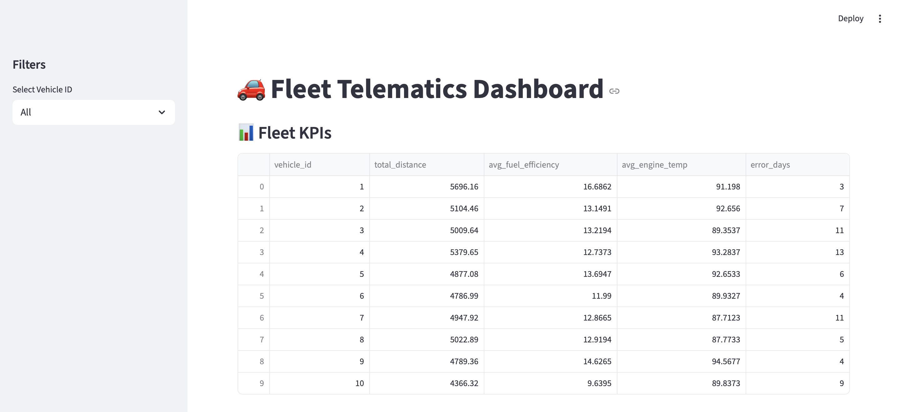
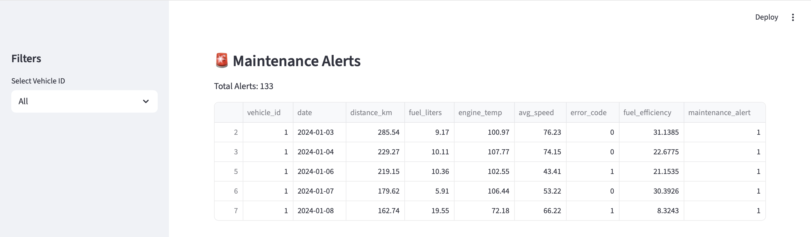
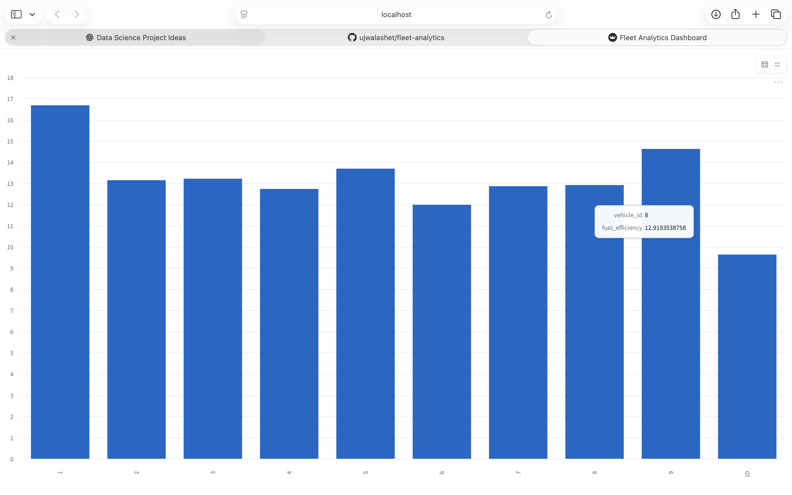

**🚗 Fleet Telematics Analytics & Predictive Maintenance Pipeline**

**📌 Project Overview**
This project implements an end-to-end fleet telematics analytics and predictive maintenance pipeline.
It simulates real-world vehicle telemetry data, processes it through a structured ETL workflow, computes operational KPIs, and applies both rule-based and machine learning–based predictive logic.

The project is designed to reflect industry-style data engineering and analytics workflows commonly used in fleet management and smart mobility systems.
🏗️ System Architecture
Synthetic Data Generation
Data Cleaning & Validation
Feature Engineering
Relational Database Storage
Analytics & KPI Computation
Predictive Maintenance (Rules + ML)

## 📊 Dashboard Preview

### Fleet Analytics Dashboard
The interactive dashboard provides real-time insights into fleet performance, vehicle efficiency, and maintenance risks.

### Maintenance Alerts
Vehicles are proactively flagged based on engine temperature thresholds and error occurrences.

### Fuel Efficiency Analysis
Average fuel efficiency comparison across vehicles helps identify underperforming assets.

## 🧠 Contributors & Roles

### 👤 Backend Data Engineering  
**[@ujwalashet](https://github.com/ujwalashet)**  
- Designed project folder structure and ETL pipeline  
- Generated synthetic fleet telematics data  
- Cleaned and validated raw datasets  
- Engineered derived features (fuel efficiency)  
- Loaded processed data into SQLite database  

---

### 👤 Analytics & AIML  
**[@sindgisrishtis](https://github.com/sindgisrishtis)**  
- Performed exploratory data analysis and data validation  
- Defined fleet KPIs (utilization, efficiency, error frequency)  
- Derived analytical insights from telemetry patterns  
- Implemented rule-based maintenance alert logic  
- Built an explainable ML baseline (Logistic Regression)  
- Evaluated model performance and documented limitations  

**📊 Key Features**
Fleet-level KPI computation
Vehicle-wise performance comparison
Predictive maintenance alerting
Explainable machine learning baseline
Clean, reproducible analytics workflow

**🛠️ Tech Stack**
Python
Pandas
SQLite
Scikit-learn
Jupyter Notebook (analysis & sanity checks)
VS Code

**▶️ How to Run the Pipeline**
python etl/generate_data.py
python etl/clean_data.py
python etl/load_to_db.py
This will:
Generate synthetic telematics data
Clean and preprocess it
Load the final dataset into fleet.db

**🤖 Predictive Maintenance Logic**
**Rule-Based Alerts**
Triggered when:
Engine temperature exceeds a threshold
Error codes are detected
**ML-Based Extension**
Logistic Regression model trained to predict error occurrence
Demonstrates supervised learning on telemetry features
Highlights challenges of class imbalance in real-world data

**📈 Use Cases**
Fleet performance monitoring
Maintenance risk identification
Analytics-driven decision support
Foundation for real-time fleet systems

**📌 Notes**
The dataset is synthetic and created for learning purposes
The focus is on analytics clarity and explainability, not model complexity
The pipeline is easily extendable to real-world telematics data

**🏁 Conclusion**
This project demonstrates how data engineering, analytics, and AIML work together in production-style systems.
It emphasizes clean data pipelines, business-driven KPIs, and interpretable predictive logic—key skills for analytics and AIML roles.
